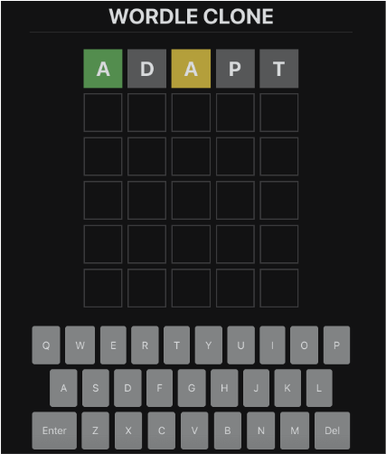
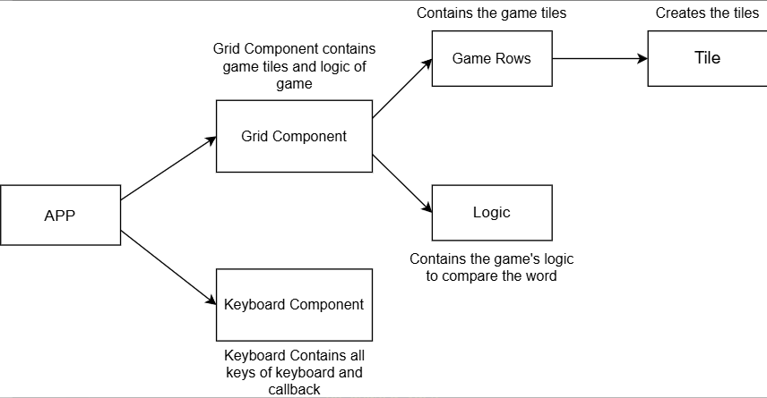

# Wordle Clone Project

In this project, we’ll build a clone of the popular web-based game Wordle with a fully functioning grid and keyboard. We’ll develop the front end of this web application with React and use Bootstrap to style the game.

  

## Prerequisites

- Basic understanding of React components and state
- Basic understanding of React useState and useEffect Hooks
- Good understanding of Javascript, including arrow functions and array handling
- Basic understanding of React’s Bootstrap

  
   &nbsp;&nbsp;&nbsp;&nbsp;&nbsp;&nbsp;

## Project Description

In this project, we’ll build a clone of Wordle, a popular guessing game where the goal is to figure out the correct five-letter word of the day. We’ll be asked to fill in the missing code snippets and gradually create segments of Wordle.

Wordle should have a letter grid and a keyboard to add and remove letters. Each letter in the grid is compared with a randomly selected letter of the word.

- If we enter a letter of the word in the correct spot, it turns the tile green.
- A correct letter in the wrong spot turns the tile yellow.
- If we enter a letter that the word does not contain, it turns the tile gray.
- When we guess the correct word in its entirety, it turns the letter row green. The game ends there and we win!
- If we haven’t guessed the word by the sixth try, the game ends there too.

When we’re done, our web application should be like the following:

## Detailed Architecture

<b>A detailed architecture of the project, along with each module, is shown in the figure</b>

  

You’ll do most of the development in the following files:

1. `App.js:` This file contains the App component, the main component of this application that calls the grid and keyboard components. This component can be found in the `./wordle-project/src/App.js` file.

2. `acceptableWords.js`: This file contains all the five-letter words that will be used in the game. This component can be found in the `./wordle-project/src/Assets/acceptableWords.js` file.

3. `KeyboardComponent.jsx`: This file will be used to develop the virtual keyboard of Wordle. This component can be found in the `./wordle-project/src/Components/KeyboardComponent.jsx` file.

The following components can be found inside the `./wordle-project/src/Components/Grid` directory.

4. `Tile.jsx`: This file will be used to create a cell of the grid.

5. `GameRow.jsx`: This file will be used to create a row of the grid.

6. `GridComponent.jsx`: This file will be used to develop the complete Wordle grid.

7. `Logic.js`: This file will be used to implement the game logic.
